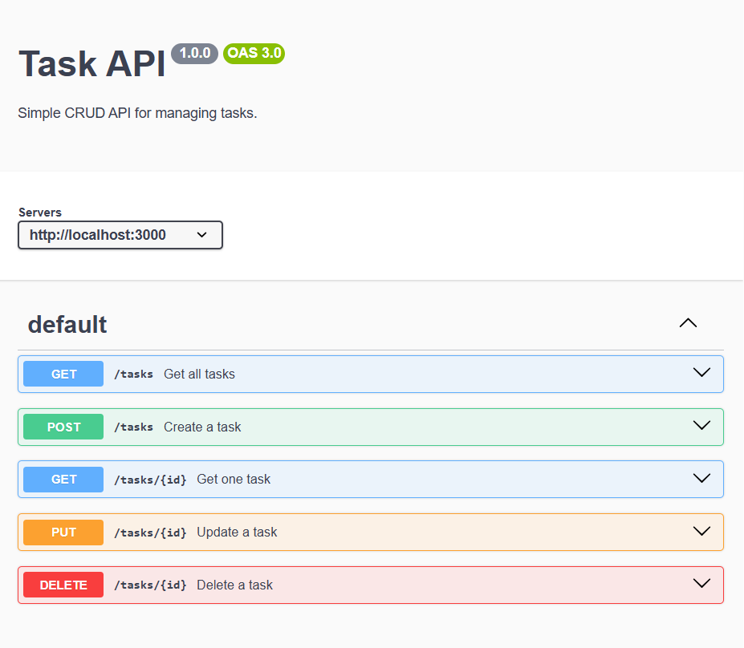
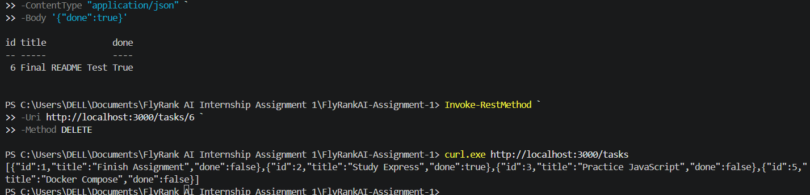
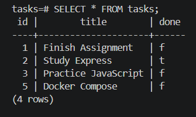

# FlyRank AI Internship Assignment 1

## Overview

This project is a RESTful Task Management API built with **Node.js**, **Express.js**, and **PostgreSQL**. It provides a complete CRUD (Create, Read, Update, Delete) API for managing tasks while demonstrating backend development concepts such as database integration, containerization, environment configuration, and API documentation.

The application is containerized using **Docker** and **Docker Compose**, allowing both the API and PostgreSQL database to run together with a single command.

---

## Features

- RESTful API built with Express.js
- PostgreSQL database integration
- Full CRUD operations for tasks
- Automatic database and table initialization
- Health check endpoint
- Interactive Swagger API documentation
- Docker & Docker Compose support
- Environment variable configuration using `.env`
- Persistent database storage using Docker volumes

---

## Technologies Used

- Node.js
- Express.js
- PostgreSQL
- pg (PostgreSQL Node.js Driver)
- Docker
- Docker Compose
- Swagger UI Express
- OpenAPI (YAML)
- dotenv

---

## Project Structure

```text
FlyRankAI-Assignment-1
│
├── db/
│   └── postgres.js
├── .dockerignore
├── .env.example
├── .gitignore
├── docker-compose.yml
├── Dockerfile
├── openapi.yaml
├── package.json
├── package-lock.json
├── README.md
└── server.js
```

---

## Prerequisites

Install the following before running the project:

- Node.js (v18 or later)
- Docker Desktop
- Docker Compose

---

## Environment Variables

Create a `.env` file in the project root.

```env
DB_HOST=db
DB_PORT=5432
DB_USER=postgres
DB_PASSWORD=postgres
DB_NAME=tasks
```

---

## Running with Docker (Recommended)

Build and start the API and PostgreSQL containers:

```bash
docker compose up --build
```

The API will be available at:

```
http://localhost:3000
```

To stop the containers:

```bash
docker compose down
```

---

## Running Locally

Install dependencies:

```bash
npm install
```

Start the server:

```bash
node server.js
```

> Ensure PostgreSQL is running and the environment variables are configured correctly before starting the server.

---

## API Documentation

Swagger UI is available at:

```
http://localhost:3000/docs
```

---

## API Endpoints

| Method | Endpoint | Description |
|----------|----------------|---------------------------|
| GET | `/` | API information |
| GET | `/health` | Health check |
| GET | `/tasks` | Retrieve all tasks |
| GET | `/tasks/:id` | Retrieve a single task |
| POST | `/tasks` | Create a new task |
| PUT | `/tasks/:id` | Update an existing task |
| DELETE | `/tasks/:id` | Delete a task |

---

## Example Request

### Create a Task

**Request**

```http
POST /tasks
Content-Type: application/json

{
  "title": "Learn Docker"
}
```

**Response**

```json
{
  "id": 6,
  "title": "Learn Docker",
  "done": false
}
```

---

## Database

The application automatically:

- Creates the `tasks` table if it does not already exist.
- Inserts sample tasks when the table is empty.
- Persists data using a Docker volume, ensuring tasks remain available after container restarts.

---

## Testing

The API was successfully tested using:

- curl
- PowerShell `Invoke-RestMethod`
- Swagger UI
- PostgreSQL (`psql`)

Verified functionality:

- ✅ Retrieve all tasks
- ✅ Retrieve a task by ID
- ✅ Create a task
- ✅ Update a task
- ✅ Delete a task
- ✅ Verify data persistence in PostgreSQL

---

## Sample SQL Queries

Retrieve all tasks:

```sql
SELECT * FROM tasks;
```

Retrieve completed tasks:

```sql
SELECT * FROM tasks
WHERE done = TRUE;
```

Count all tasks:

```sql
SELECT COUNT(*) FROM tasks;
```

---

## Screenshots

### Swagger UI



### API Testing



### PostgreSQL Database




---

## Future Improvements

Possible enhancements include:

- User authentication and authorization
- Task filtering and searching
- Pagination
- Request validation
- Unit and integration testing
- CI/CD pipeline

---

## Author

**Abdelkerim Mahamat Habib**

Created as part of the **FlyRank AI Backend Engineering Internship**.